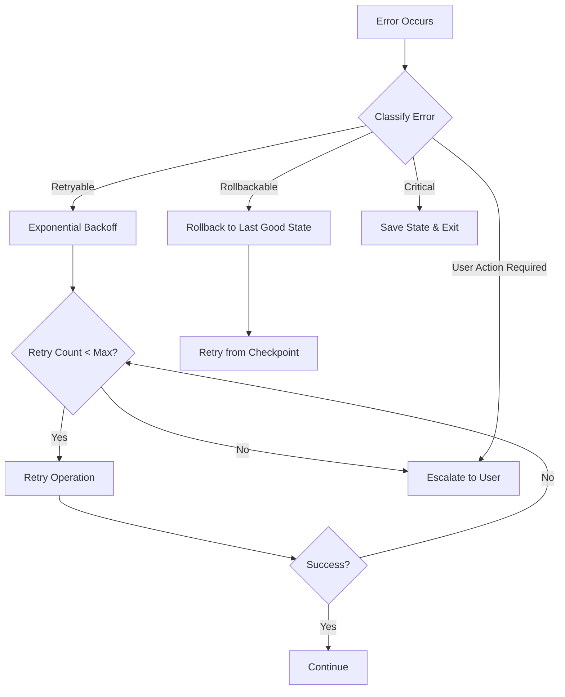

# 🛡️ Edge Case Handling

Comprehensive documentation of all edge cases handled by the autonomous development system.

## Table of Contents

1. [Network & Connectivity](#network--connectivity)
2. [Resource Management](#resource-management)
3. [Code Conflicts](#code-conflicts)
4. [State Management](#state-management)
5. [Agent Failures](#agent-failures)
6. [Dependencies](#dependencies)
7. [Testing Scenarios](#testing-scenarios)
8. [Recovery Strategies](#recovery-strategies)

---

## Network & Connectivity

### 1. **Agent Timeout**
**Scenario**: OpenCode agent takes too long to respond

**Detection**:
```javascript
timeout: 300000 // 5 minutes per agent
```

**Handling**:
- Automatic timeout after 5 minutes
- Agent process killed gracefully (SIGTERM)
- Error classified as retryable
- Retry with exponential backoff

**Recovery**:
```javascript
const backoffMs = Math.min(1000 * Math.pow(2, retryCount - 1), 10000);
await new Promise(resolve => setTimeout(resolve, backoffMs));
```

### 2. **Network Connection Lost**
**Errors**: `ECONNRESET`, `ETIMEDOUT`, `ENOTFOUND`

**Handling**:
- Classified as retryable
- Up to 3 retry attempts
- Backoff: 1s → 2s → 4s
- State saved before each retry

**Example**:
```javascript
const classification = EdgeCaseClassifier.classify(error);
if (classification.retryable && state.retryCount < state.maxRetries) {
  return { retryCount: state.retryCount + 1 };
}
```

### 3. **Rate Limiting (429)**
**Scenario**: Too many API calls to OpenCode/AI provider

**Handling**:
- Detected via error code 429
- Exponential backoff (max 10 seconds)
- Reduces parallel agent count
- Continues with degraded capacity

**Mitigation**:
```javascript
if (errorMsg.includes('429') || errorMsg.includes('rate limit')) {
  const backoffMs = Math.min(1000 * Math.pow(2, retryCount), 10000);
  // Wait and retry
}
```

---

## Resource Management

### 4. **Memory Exhaustion**
**Scenario**: Heap usage exceeds 90%

**Detection**:
```javascript
const memory = process.memoryUsage();
const percentage = (memory.heapUsed / memory.heapTotal) * 100;
if (percentage > 90) {
  // Take action
}
```

**Handling**:
1. Warn and log memory usage
2. Reduce parallel agents (3 → 2 → 1)
3. Clean temporary files
4. Force garbage collection if available
5. Save state and graceful exit if critical

**Recovery**:
```javascript
// Reduce concurrency
const agentCount = resourceUsage.memory > 90 ? 1 : 3;

// Cleanup
await ResourceMonitor.cleanupTempFiles();
```

### 5. **Disk Space Exhaustion**
**Errors**: `ENOSPC`, "no space left"

**Handling**:
1. Detect via error or `df -h` check
2. Clean temp files in `node_modules/.cache`
3. Delete old backups (keep last 10)
4. Remove old checkpoints (keep last 5)
5. If still insufficient, escalate to user

**Prevention**:
```javascript
// Check before large operations
const disk = await ResourceMonitor.checkDiskSpace();
if (disk.percentage > 95) {
  await ResourceMonitor.cleanupTempFiles();
}
```

### 6. **GitHub Actions Timeout**
**Scenario**: Workflow exceeds 25-minute limit

**Handling**:
- Internal timeout set to 23 minutes (2-min buffer)
- Checkpoint saved every node execution
- Graceful exit with state preservation
- Next run resumes from checkpoint

**Implementation**:
```javascript
const timeoutAt = Date.now() + TIMEOUT_MS;

// Check in main loop
if (await checkTimeout(state)) {
  console.log('⏰ Timeout approaching, saving state...');
  await saveCheckpoint(state);
  break;
}
```

---

## Code Conflicts

### 7. **Merge Conflicts**
**Scenario**: Multiple agents modify same file regions

**Detection**:
```javascript
// Git conflict markers
if (content.includes('<<<<<<< HEAD')) {
  // Conflict detected
}
```

**Handling**:
1. Detect conflicts after parallel merge
2. Analyze conflict markers
3. Attempt auto-resolution for simple cases
4. Otherwise, create GitHub Issue with:
   - Conflicting file paths
   - Conflict diffs
   - Suggested resolution
5. Assign to user, mark as blocked

**Auto-Resolution** (limited):
- Import statements (deduplicate)
- Non-overlapping changes
- Whitespace conflicts

### 8. **Semantic Conflicts**
**Scenario**: Duplicate functions, circular dependencies

**Detection**:
```javascript
const conflicts = await ConflictResolver.detectConflicts(files);
// Checks for:
// - Duplicate function names
// - Duplicate imports
// - Conflicting class definitions
```

**Handling**:
- Deduplicate imports automatically
- Flag duplicate functions for user review
- Detect circular dependencies in import graph
- Prevent commits with circular deps

**Example**:
```javascript
const cycles = await DependencyResolver.checkCircularDependencies(files);
if (cycles.length > 0) {
  throw new Error(`Circular dependency: ${cycles[0].join(' -> ')}`);
}
```

### 9. **Lost Changes / Git State Corruption**
**Scenario**: Git index becomes corrupted, detached HEAD

**Handling**:
1. Create rollback point before each milestone
2. Save commit hash + branch name
3. On corruption, reset to last known good state
4. Restore from rollback point
5. Re-apply changes if possible

**Rollback**:
```javascript
const rollbackPoint = await RollbackManager.createRollbackPoint('milestone-1');

// Later, if needed
await RollbackManager.rollback(rollbackPoint);
```

---

## State Management

### 10. **State File Corruption**
**Scenario**: `current-session.json` becomes invalid JSON

**Detection**:
```javascript
try {
  JSON.parse(content);
} catch {
  // Corrupted
}
```

**Handling**:
1. Attempt JSON repair (remove trailing commas, etc.)
2. Validate state structure
3. Restore from latest backup
4. If all fail, start fresh with warning

**Validation**:
```javascript
const { valid, issues } = await StateRecovery.validateState(state);
if (!valid) {
  const repaired = await StateRecovery.repairState(state);
  await StateRecovery.createBackup(repaired, 'recovered');
}
```

### 11. **Checkpoint Desync**
**Scenario**: Checkpoint doesn't match actual git state

**Detection**:
```javascript
const checkpointCommit = state.lastCheckpoint?.commit;
const actualCommit = await git.getLastCommit();

if (checkpointCommit !== actualCommit) {
  // Desync detected
}
```

**Handling**:
- Compare checkpoint commit with actual HEAD
- If mismatch, trust git state (source of truth)
- Update checkpoint to match reality
- Recalculate progress from git history

### 12. **Circular State References**
**Scenario**: State object contains circular references (can't stringify)

**Detection**:
```javascript
try {
  JSON.stringify(state);
} catch (error) {
  // Circular reference
}
```

**Handling**:
```javascript
// Remove circular fields
const safe = {};
for (const [key, value] of Object.entries(state)) {
  try {
    JSON.stringify(value);
    safe[key] = value;
  } catch {
    console.warn(`Removed circular field: ${key}`);
  }
}
```

---

## Agent Failures

### 13. **Agent Produces Invalid Output**
**Scenario**: Agent returns non-JSON or malformed JSON

**Detection**:
```javascript
try {
  const result = JSON.parse(output);
} catch {
  // Invalid output
}
```

**Handling**:
1. Try to extract JSON from markdown code blocks
2. Look for JSON between `{` and `}` markers
3. If extraction fails, retry with explicit JSON instruction
4. After max retries, escalate to user

**Extraction**:
```javascript
const match = text.match(/```json\s*([\s\S]*?)\s*```/) ||
              text.match(/\{[\s\S]*\}/);
if (match) {
  return JSON.parse(match[1] || match[0]);
}
```

### 14. **Agent Produces Placeholder Code**
**Scenario**: Agent writes `// TODO` or `/* implementation here */`

**Detection**:
```javascript
if (code.includes('TODO') ||
    code.includes('placeholder') ||
    code.includes('implement here')) {
  // Placeholder detected
}
```

**Handling**:
1. Reject output as invalid
2. Retry with stronger prompt:
   - "NO placeholders"
   - "Production-ready code only"
   - "Complete implementation required"
3. After 3 attempts, flag as needs-user-input

### 15. **Parallel Agent Failures**
**Scenario**: Some agents succeed, others fail

**Handling**:
```javascript
const results = await Promise.all(agentPromises);
const failures = results.filter(r => !r.success);

if (failures.length > 0) {
  // Option 1: Rollback all changes
  await git.rollback(rollbackPoint);

  // Option 2: Keep successful changes, retry failed
  for (const failure of failures) {
    await retryAgent(failure.agentId);
  }
}
```

**Strategy**:
- If 1-2 agents fail out of 3: retry failed only
- If all agents fail: rollback and retry entire milestone
- If persistent failures: escalate to user

---

## Dependencies

### 16. **Missing Dependencies**
**Errors**: `MODULE_NOT_FOUND`, "cannot find module"

**Detection**:
```javascript
if (error.code === 'MODULE_NOT_FOUND') {
  const match = error.message.match(/Cannot find module '(.+)'/);
  const missingModule = match?.[1];
}
```

**Handling**:
1. Extract missing module name
2. Check if it's in package.json
3. If not, add to plan's dependencies
4. Auto-install if confidence > 0.8
5. Otherwise, ask user for approval

**Auto-Install**:
```javascript
const result = await DependencyResolver.installMissingDependencies([
  'express',
  'zod'
]);

if (!result.success) {
  // Escalate to user
}
```

### 17. **Circular Dependencies**
**Scenario**: File A imports B, B imports A

**Detection**:
```javascript
const cycles = await DependencyResolver.checkCircularDependencies(files);
// Returns: [['fileA.js', 'fileB.js', 'fileA.js']]
```

**Handling**:
1. Detect cycles in import graph
2. Report cycle path to user
3. Suggest refactoring (extract common interface)
4. Block commit until resolved

**Prevention**:
- Check before committing
- Agent prompted to avoid circular deps

### 18. **Version Conflicts**
**Scenario**: New dependency conflicts with existing version

**Detection**:
```bash
npm install fails with peer dependency error
```

**Handling**:
1. Parse npm error for conflict details
2. Check if forced install is safe
3. Create issue explaining conflict
4. Let user decide resolution strategy

---

## Testing Scenarios

### 19. **Tests Fail After Implementation**
**Scenario**: Code works but breaks existing tests

**Handling**:
1. Run tests after each milestone
2. If tests fail, analyze failure:
   - **Syntax error**: rollback, regenerate code
   - **Logic error**: ask reviewer agent to fix
   - **Test needs update**: flag for user review
3. Don't proceed to next milestone until green

**Flow**:
```javascript
const testResults = await runTests();

if (!testResults.passed) {
  if (isCodeError(testResults)) {
    // Rollback and retry
    await git.rollback(rollbackPoint);
    return { retryCount: state.retryCount + 1 };
  } else {
    // Tests need updating - user input
    return {
      needsUserInput: true,
      userQuestion: 'Tests failed - manual review needed'
    };
  }
}
```

### 20. **No Tests Available**
**Scenario**: Project has no test suite

**Handling**:
- Detect via `npm test` returning error
- Treat as warning, not blocker
- Continue with implementation
- Log: "⚠️ No tests found, skipping test phase"
- Recommend adding tests in review

---

## Recovery Strategies

### 21. **Automatic Recovery Flow**



### 22. **Escalation Thresholds**

| Retry Count | Action |
|-------------|--------|
| 0 | First attempt |
| 1 | Retry with 1s backoff |
| 2 | Retry with 2s backoff |
| 3 | Retry with 4s backoff |
| 4+ | Create GitHub Issue, assign to user |

### 23. **State Preservation Guarantee**

**Every checkpoint includes**:
```json
{
  "sessionId": "session-123",
  "phase": "implementing",
  "currentMilestone": 2,
  "plan": { ... },
  "rollbackPoint": {
    "commit": "abc123",
    "branch": "dev"
  },
  "lastCheckpoint": "2024-02-05T10:30:00Z"
}
```

**Saved after**:
- Every node execution
- Before each milestone
- On error
- On timeout
- Every 5 minutes (heartbeat)

### 24. **Complete Failure Recovery**

If system fails completely:

1. **Resume from checkpoint**:
   ```bash
   export RESUME=true
   node scripts/orchestrator-langgraph.js
   ```

2. **Restore from backup**:
   ```bash
   ls state/backups/
   # Copy desired backup to state/current-session.json
   ```

3. **Rollback git changes**:
   ```bash
   ls state/rollbacks/
   # Review rollback points
   git reset --hard <commit>
   ```

4. **Fresh start** (last resort):
   ```bash
   rm state/current-session.json
   export IDEA_ID=same-idea
   node scripts/orchestrator-langgraph.js
   ```

---

## Testing Edge Cases

### Manual Testing Checklist

```bash
# 1. Test timeout handling
TIMEOUT_MINUTES=1 npm start

# 2. Test network failure
# (Disconnect network mid-run)

# 3. Test memory exhaustion
# (Run with --max-old-space-size=256)

# 4. Test state corruption
echo "invalid json" > state/current-session.json
export RESUME=true
npm start

# 5. Test merge conflicts
# (Manually edit same file in two branches)

# 6. Test missing dependencies
# (Remove a package from package.json)

# 7. Test circular dependencies
# (Create fileA imports fileB imports fileA)

# 8. Test agent timeout
# (Slow model + short timeout)

# 9. Test parallel agent failures
# (Kill agent process mid-execution)

# 10. Test rollback
# (Force failure after milestone commit)
```

---

## Monitoring & Alerts

### What to Monitor

1. **Resource usage** - Memory, CPU, disk
2. **Error rates** - By type and severity
3. **Retry counts** - High retries = systemic issue
4. **Checkpoint frequency** - Should be regular
5. **Agent timeouts** - Might need model adjustment
6. **User escalations** - Track blocking issues

### Alert Thresholds

- **Critical**: Memory > 90%, disk > 95%, 3+ consecutive failures
- **Warning**: Retry count > 2, timeout approaching
- **Info**: Checkpoint saved, milestone completed

---

## Best Practices

1. **Always create rollback points** before risky operations
2. **Save checkpoints frequently** (after every node)
3. **Classify errors immediately** for proper handling
4. **Prefer automatic recovery** over user escalation
5. **Log verbosely** for debugging
6. **Test edge cases** in development
7. **Monitor resource usage** proactively
8. **Keep backups** of state and git
9. **Document custom edge cases** as they're discovered
10. **Review recovery logs** to improve handling

---

## Contributing

Found a new edge case? Add it to this document with:

1. **Scenario** description
2. **Detection** method
3. **Handling** strategy
4. **Code example**
5. **Test case**

Keep the system resilient! 🛡️
